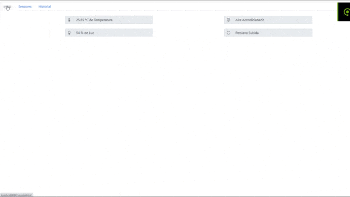

# Domotic-DSD
Domotic System made with NodeJs connected to mongodb and twitterAPI.

No twitter conection is implemented on this version. Follow this [tutorial](https://dev.to/ahmed_mahallawy/tweeting-using-node-js-5986) to do so. Mi version has it and tweets [here](https://twitter.com/p4_dsd).

<br/>

To execute you need to have node-js with the required modules and mongodb running.

Start mongodb and keep it open on background.
  ```
    sudo mongod
  ```
Then open a terminal and write:
  ```
    nodejs servidor.js
  ```

The last thing you need to do is go to http://localhost:8080/ whith your browser.


